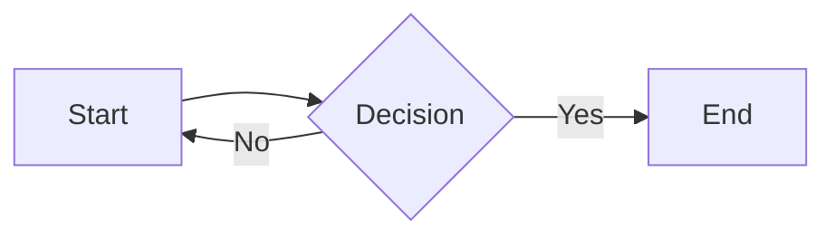

# Extensions

Zensical builds on **Python Markdown** and the **PyMdown Extensions** library. Extensions unlock additional Markdown syntax — admonitions, content tabs, diagrams, math, and more.

!!! danger "Extensions are all-or-nothing"
    As soon as you define any `[project.markdown_extensions.*]` entry, defaults stop applying partially. You must list every extension you want enabled. Missing one means it's off.

## Recommended Starting Configuration

```toml title="zensical.toml"
# Call-outs and collapsible blocks
[project.markdown_extensions.admonition]
[project.markdown_extensions.pymdownx.details]

# Nested fences and custom fences (e.g. Mermaid)
[project.markdown_extensions.pymdownx.superfences]

[[project.markdown_extensions.pymdownx.superfences.custom_fences]]
name   = "mermaid"
class  = "mermaid"
format = "pymdownx.superfences.fence_code_format"

# Syntax highlighting
[project.markdown_extensions.pymdownx.highlight]
anchor_linenums     = true
line_spans          = "__span"
pygments_lang_class = true

[project.markdown_extensions.pymdownx.inlinehilite]

# Content tabs
[project.markdown_extensions.pymdownx.tabbed]
alternate_style = true

# Icons and emojis
[project.markdown_extensions.pymdownx.emoji]
emoji_index     = "zensical.extensions.emoji.twemoji"
emoji_generator = "zensical.extensions.emoji.to_svg"

# File snippets / includes
[project.markdown_extensions.pymdownx.snippets]

# Text formatting
[project.markdown_extensions.pymdownx.critic]
[project.markdown_extensions.pymdownx.mark]
[project.markdown_extensions.pymdownx.tilde]
[project.markdown_extensions.pymdownx.caret]

# HTML attributes on Markdown elements
[project.markdown_extensions.attr_list]

# Markdown inside HTML blocks
[project.markdown_extensions.md_in_html]

# Footnotes, tables, abbreviations, definition lists
[project.markdown_extensions.footnotes]
[project.markdown_extensions.tables]
[project.markdown_extensions.abbr]
[project.markdown_extensions.def_list]

# Headings with anchor links
[project.markdown_extensions.toc]
permalink = true
```

## Extension Reference

### admonition

Enables call-out blocks. See [Admonitions](admonitions.md) for full usage.

```markdown
!!! note
    A standard note.
```

### pymdownx.details

Collapsible admonitions via `???` syntax. Requires `admonition`.

```markdown
??? tip "Expand me"
    Hidden by default.

???+ warning "Open by default"
    Shown, but collapsible.
```

### pymdownx.superfences

Extends fenced code blocks to support nesting and custom handlers.

**Code annotations** (requires `content.code.annotate` feature):

````markdown
```python
result = heavy_computation()  # (1)!
```

1. This annotation explains line 1.
````

**Custom fences** (e.g. Mermaid diagrams):

````markdown

````

### pymdownx.highlight

Syntax highlighting powered by Pygments. Options:

| Option | Effect |
|--------|--------|
| `anchor_linenums = true` | Line numbers become anchor links |
| `line_spans = "__span"` | Wraps each line in a `<span>` for CSS targeting |
| `pygments_lang_class = true` | Adds the language as a class on the `<code>` element |
| `linenums = true` | Show line numbers on all blocks by default |
| `linenums_style = "table"` | Render line numbers in a table (copy-safe) |

**Per-block overrides:**

````markdown
```python linenums="1" hl_lines="2 3"
def foo():
    x = 1   # highlighted
    y = 2   # highlighted
    return x + y
```
````

### pymdownx.tabbed

Content tabs for showing multiple variants side-by-side.

```markdown
=== "Python"

    ```python
    print("Hello, world!")
    ```

=== "JavaScript"

    ```js
    console.log("Hello, world!");
    ```
```

Requires `alternate_style = true` for the Zensical-compatible rendering.

### pymdownx.snippets

Include content from external files:

```markdown
--8<-- "docs/includes/disclaimer.md"
```

Useful for reusing content across pages (changelogs, legal text, shared examples).

### pymdownx.arithmatex

LaTeX math rendering with MathJax or KaTeX:

```toml
[project.markdown_extensions.pymdownx.arithmatex]
generic = true
```

Then add MathJax to your `extra_javascript`:

```toml
[[project.extra_javascript]]
path = "https://unpkg.com/mathjax@3/es5/tex-mml-chtml.js"
```

Usage in Markdown:

```markdown
Inline: $E = mc^2$

Block:
$$
\int_{-\infty}^{\infty} e^{-x^2} dx = \sqrt{\pi}
$$
```

### attr_list

Add HTML attributes to any Markdown element:

```markdown
[Download](#){ .md-button .md-button--primary }

{ width="300" loading="lazy" }

## My Heading { #custom-anchor }
```

### md_in_html

Process Markdown inside raw HTML blocks:

```markdown
<div class="grid" markdown>

- Item one with **bold**
- Item two with `code`

</div>
```

Required for Zensical grid layouts.
